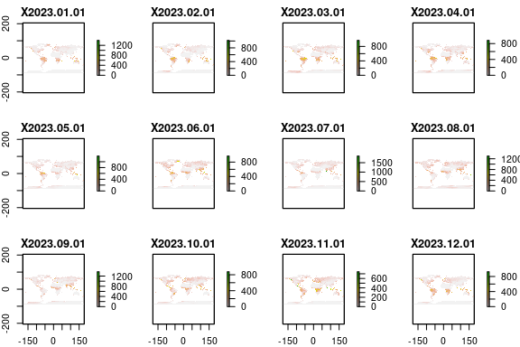
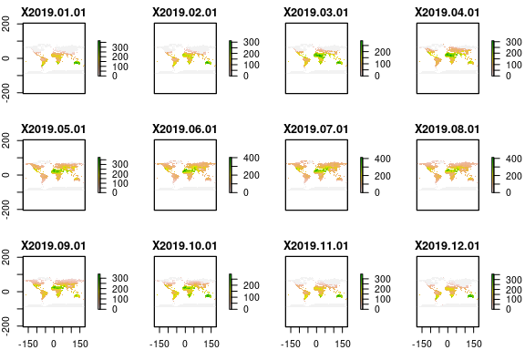
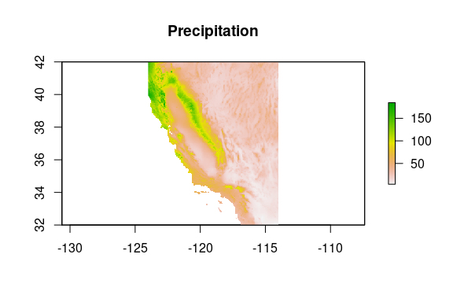
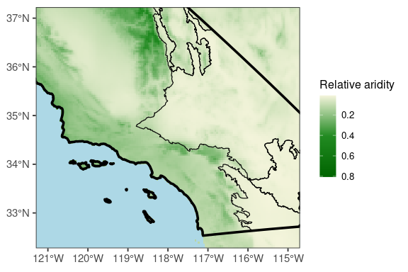
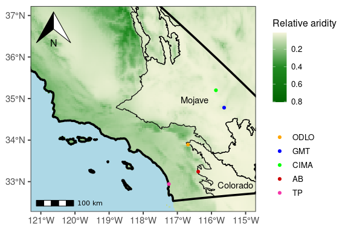

---
---
---

# Map of field sites with aridity gradient

Kian Kelly

# Load Libraries

``` r
library(GGally)
library(tidyverse)
library(scales)
library(network)
library(vroom)
library(phyloseq)
library(vegan)
library(patchwork)
library(ggnewscale)
library(ggforce)
library(geosphere)
library(rnaturalearth)
library(sf)
library(rnaturalearthdata)
library(dplyr)
library(raster)
library(purrr)
library(USAboundaries)
library(USAboundariesData)
library(ggspatial)
```

### Adaped from: <https://www.painblogr.org/2020-12-15-climate-change.html>

# Download the files from the TerraClimate website

``` r
#--- Download the files from the TerraClimate website ---#
# Precipitation
download.file(url = "http://thredds.northwestknowledge.net:8080/thredds/fileServer/TERRACLIMATE_ALL/data/TerraClimate_ppt_2023.nc",
    destfile = "ppt.nc")

# Evapotranspiration
download.file(url = "http://thredds.northwestknowledge.net:8080/thredds/fileServer/TERRACLIMATE_ALL/data/TerraClimate_pet_2019.nc",
    destfile = "pet.nc")

#--- Import the downloaded files ---#
# Precipitation
ppt <- stack(x = "ppt.nc")
```

```         
## Loading required namespace: ncdf4

## Warning in .getCRSfromGridMap4(atts): cannot process these parts of the crs:
## long_name=crs
```

``` r
# Evapotranspiration
pet <- stack(x = "pet.nc")
```

```         
## Warning in .getCRSfromGridMap4(atts): cannot process these parts of the crs:
## long_name=crs
```

``` r
#--- Inspect ---#
# Precipitation
plot(ppt)
```

<!-- -->

``` r
# Evapotranspiration
plot(pet)
```

<!-- -->

# Calculate average Precipitation and Evapotranspiration for the world

``` r
#--- Raster maths ---#
# Precipitation
ppt_mean <- calc(ppt, # RasterStack object
                 fun = mean, # Function to apply across the layers
                 na.rm = TRUE)

# Evapotranspiration
pet_mean <- calc(pet,
                 fun = mean, 
                 na.rm = TRUE)
```

## Crop for California

``` r
#--- Set the extent ---#
# Cut off all values outside California
ext <- extent(c(xmin = -124, xmax = -114, ymin = 32, ymax = 42))


#--- Crop ---#
# Precipitation
ppt_mean_cal <- crop(x = ppt_mean, y = ext)

# Evapotranspiration
pet_mean_cal <- crop(x = pet_mean, y = ext)

#--- Inspect ---#
# Precipitation
plot(main = "Precipitation", ppt_mean_cal)
```

<!-- -->

# Calculate aridity by overlaying the rasters and get ratio of Evapotranspiration to Precipitation

``` r
#--- Calculate aridity index ---#
# Precipitation (ppt) / Evapotranspiration (pet)
aridity_index <- overlay(x = ppt_mean_cal, # Raster object 1
                         y = pet_mean_cal, # Raster object 2
                         fun = function(x, y){return(x / y)}) # Function to apply

plot(main = 'Aridity index',
     aridity_index)
```

<!-- -->

## Convert to a df and log normalize for relative aridity

``` r
#--- Convert raster to a matrix ---#
aridity_index_matrix <- rasterToPoints(aridity_index)

#--- Convert to the matrix to a dataframe ---#
aridity_index_df <- as.data.frame(aridity_index_matrix)


aridity_index_df$layer = log10(aridity_index_df$layer + 1)
#--- Recode aridity index into categories --#
# aridity_index_df <- aridity_index_df %>% Recode
# mutate(category = case_when( is.infinite(layer) ~
# 'Humid', layer >= 0.65 ~ 'Humid', layer >= 0.5 & layer <
# 0.65 ~ 'Dry sub-humid', layer >= 0.2 & layer < 0.5 ~
# 'Semi-arid', layer >= 0.05 & layer < 0.2 ~ 'Arid', layer
# < 0.05 ~ 'Hyper-arid' )) %>% Convert to ordered factor
# mutate(category = factor(category, levels =
# c('Hyper-arid', 'Arid', 'Semi-arid', 'Dry sub-humid',
# 'Humid'), ordered = TRUE))
```

# Plot the first map

## Get California geometry and turn to sf object

``` r
# Get the geometry of California
ca <- us_states(states = "CA", resolution = "high")

ca_geom <- st_as_sf(ca)
```

## Read in shapefile for California Deserts

``` r
# Path to your shapefile source:
# https://www.sciencebase.gov/catalog/item/5835e1cae4b0d9329c801b7b
shapefile_path_moja <- "./ca_sections.shp"

# Read the shapefile
shapefile_mojave <- st_read(shapefile_path_moja)
```

```         
## Reading layer `ca_sections' from data source 
##   `/rhome/kkell060/California_Desert_Aridity_Map/ca_sections.shp' 
##   using driver `ESRI Shapefile'
## Simple feature collection with 5 features and 2 fields
## Geometry type: MULTIPOLYGON
## Dimension:     XY
## Bounding box:  xmin: -2049212 ymin: 1242364 xmax: -1646663 ymax: 2156443
## Projected CRS: USA_Contiguous_Albers_Equal_Area_Conic_USGS_version
```

``` r
# Now you can work with the shapefile object For example,
# you can view its attributes, plot it, etc.
head(shapefile_mojave)
```

```         
## Simple feature collection with 5 features and 2 fields
## Geometry type: MULTIPOLYGON
## Dimension:     XY
## Bounding box:  xmin: -2049212 ymin: 1242364 xmax: -1646663 ymax: 2156443
## Projected CRS: USA_Contiguous_Albers_Equal_Area_Conic_USGS_version
##                    SECTION  HECTARES                       geometry
## 1            Mojave Desert 6683364.7 MULTIPOLYGON (((-1881344 17...
## 2           Sonoran Desert 1287772.2 MULTIPOLYGON (((-1647076 14...
## 3                     Mono  798113.1 MULTIPOLYGON (((-2007430 21...
## 4          Colorado Desert 1185214.8 MULTIPOLYGON (((-1706593 12...
## 5 Southeastern Great Basin 1103856.7 MULTIPOLYGON (((-1913060 18...
```

## Set a color pallette

``` r
# Define the number of colors you want in the palette
num_colors <- 10000

# Generate the palette from white to red
palette <- colorRampPalette(c("beige", "forestgreen", "darkgreen"))(num_colors)
```

## Plot first map

``` r
p <- ggplot() +
  geom_raster(data = aridity_index_df,
              aes(y = y, x = x, fill = layer)) +
  scale_fill_gradientn("Relative aridity", colours = palette) +
  theme_bw(base_size = 14) +
  theme(legend.title = element_blank(),
        legend.text = element_text(size = 10),
        axis.title = element_blank(),
        panel.grid.major = element_line(linetype = 2, 
                                        size = 0.5,
                                        colour = 'lightblue'),
        panel.grid.minor = element_blank(),
        # Set background color to blue
        panel.background = element_rect(fill = "lightblue")) + 
  geom_sf(data = ca_geom, aes(), alpha = 0, colour = "black", linewidth = 1.25) +
  geom_sf(data = shapefile_mojave, aes(), alpha = 0, colour = "black", linewidth = .4) +
  coord_sf(ylim = c(32.5, 37),
           xlim = c(-121, -115)) + 
  guides(fill = guide_colourbar(reverse = TRUE, title = "Relative aridity",
                                title.position = "top",
                                title.theme = element_text(size = 12)),
         colour = guide_legend(reverse = TRUE, title = "Relative aridity", title.position = "top")) 
```

```         
## Warning: The `size` argument of `element_line()` is deprecated as of ggplot2 3.4.0.
## ℹ Please use the `linewidth` argument instead.
## This warning is displayed once every 8 hours.
## Call `lifecycle::last_lifecycle_warnings()` to see where this warning was
## generated.
```

``` r
p
```

<!-- -->

# Plot map with compass, scale, and metadata

``` r
meta <- read_tsv("./Site_metadata.tsv")
```

```         
## Rows: 5 Columns: 4
## ── Column specification ────────────────────────────────────────────────────────
## Delimiter: "\t"
## chr (2): Site, Climate
## dbl (2): Longitude, Lattitude
## 
## ℹ Use `spec()` to retrieve the full column specification for this data.
## ℹ Specify the column types or set `show_col_types = FALSE` to quiet this message.
```

``` r
meta$Site <- factor(meta$Site, levels = c("TP", "AB", "CIMA",
    "GMT", "ODLO"))

p + ggspatial::annotation_scale(location = "bl", bar_cols = c("black",
    "white"), text_family = "ArcherPro Book") + ggspatial::annotation_north_arrow(location = "tl",
    which_north = "true", pad_x = unit(0.1, "in"), pad_y = unit(0.1,
        "in"), style = ggspatial::north_arrow_orienteering(fill = c("black",
        "white"), line_col = "black", )) + geom_text(x = -116.5,
    y = 34.8, aes(label = "Mojave"), vjust = -0.5) + geom_text(x = -115.3,
    y = 32.75, aes(label = "Colorado"), vjust = -0.5) + geom_point(data = meta,
    aes(x = Lattitude, y = Longitude, color = Site)) + scale_color_manual(name = "Geographic Area",
    values = c("#F535AA", "red3", "green", "blue", "orange",
        "pink"))
```

<!-- -->

``` r
ggsave(filename = "./art_map.png", plot = last_plot(), device = "png",
    width = 10, height = 6, dpi = 300)
```
